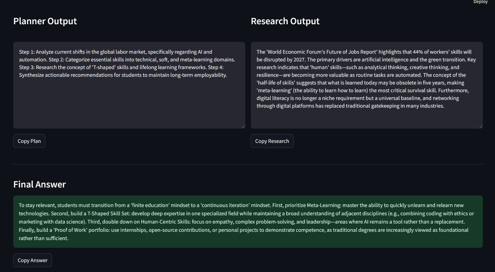

#  Autonomous AI Research Assistant

An intelligent multi-agent AI system that simulates collaborative reasoning between different agents (Planner, Researcher, Writer) to solve complex queries.

---

##  Features

- 🔹 Multi-Agent Architecture:
  - **Planner** → Breaks problem into structured steps  
  - **Researcher** → Explores and analyzes the topic  
  - **Writer** → Generates the final answer  

- 🔹 Structured JSON Outputs for reliable parsing  
- 🔹 Interactive Streamlit UI  
- 🔹 Chat History (session-based memory)  
- 🔹 Rate-limit handling for stable API usage  

---

##  Tech Stack

- **Python**
- **Gemini API (LLM)**
- **Streamlit**
- **JSON-based structured responses**

---

##  How It Works

1. User enters a query  
2. The system sends a structured prompt to the LLM  
3. The LLM simulates multiple agents:
   - Planning  
   - Research  
   - Answer generation  
4. Output is returned as structured JSON  
5. The UI renders each section separately  

---

##  Demo


---

##  Installation & Setup

```bash
# Clone the repository
git clone https://github.com/divyatiwari-24/ai-research-agent.git

# Navigate to project folder
cd ai-research-agent

# Install dependencies
pip install -r requirements.txt

# Add your API key in .env file
GEMINI_API_KEY=your_api_key_here

# Run the app
streamlit run app.py
```
---
## Project Structure
ai-research-agent/
│── app.py          # Streamlit UI
│── agents.py       # Multi-agent logic
│── llm.py          # API interaction
│── .env            # API key 
│── README.md


## Future Improvements
🔹 Real-time web search integration
🔹 Streaming responses (typing effect)
🔹 Export results (PDF / Markdown)
🔹 Advanced agent collaboration

## Author

Divya Tiwari


